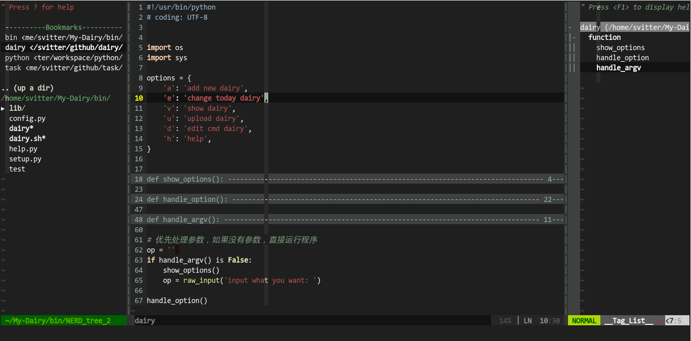

MyVimrc
===

- [task](#task)
- backup myvimrc to avoid lose it
- 里面包含大量的来自vim-scripts的插件

运行截图:
===


Install
---

###1.With Ubuntu
#### setup .vimrc

```bash 
cd 你想要的目录/
git clone https://github.com/Svtter/MyVimrc
sudo bash install
vim .vimrc
:PluginInstall   <在vim中使用，vundle本身是一个插件（用于管理插件的插件）>
```

###2.With Windows

- 首先你需要安装`git`这个工具
- 不安也行，下载右边的zip也行

然后剩下的复制粘贴吧，有时间我再写。
不过最简单的解决方案就是转移到Linux。
不爽你就咬我啊。

FAQ
---

1. 可能install脚本不够好用，存在部分问题。
2. 如果出现插件不识别的情况重新安装以下vundle 
    或者打开.vimrc使用:PluginInstall命令

### 字体自己手动安装

Function
---

- 更多功能，请细看vimrc
- press F4 添加个人信息
- press F9 编译运行cpp
- press F8 使用gdb调试
- press F2 打开nerdtree
- press tl 打开taglist 

Task
---
- [ ] add task.vim
- [ ] use gdb
